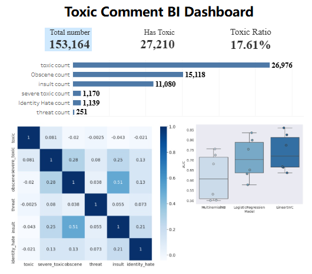

# Toxic Comment Classification

Multi-label NLP project for detecting toxic comments in online platforms.

**Multi-Label Classification | Text Preprocessing | TF-IDF | One-vs-Rest Logistic Regression | SHAP Interpretability**

---

## Project Overview

This project addresses the problem of identifying various types of toxic comments (toxic, severe_toxic, obscene, threat, insult, identity_hate) in online discussions. The goal is to predict the probability that a given comment falls into each toxic category, enabling automated moderation and safer online communities.

The dataset is derived from Wikipedia talk page edits and is publicly available via Kaggle.

The pipeline uses:

- Text preprocessing (tokenization, lemmatization, lowercasing, removing punctuation and short tokens)
- TF-IDF vectorization
- One-vs-Rest Logistic Regression for multi-label classification
- Cross-validation for performance evaluation
- SHAP-based interpretability to explain model predictions

---

## Key Results

- Multi-label One-vs-Rest Logistic Regression achieves strong predictive performance
- SHAP analysis highlights the most important words driving toxic behavior
- The pipeline is modular and reusable for new datasets or production deployment

---

## Dataset

Kaggle Competition:  
[Toxic Comment Classification Challenge](https://www.kaggle.com/c/jigsaw-toxic-comment-classification-challenge)

---

## Tableau Dashboard

Below is a static preview of the interactive Tableau Dashboard:

You can explore the live dashboard here:  
🔗 [Click to view the Tableau Dashboard]([https://public.tableau.com/app/profile/sisi.li4602/viz/toxic_comment/1](https://public.tableau.com/app/profile/sisi.li4602/viz/toxic_comment/1))

The dashboard provides insights such as:

- Overall toxic comment proportion
- Risk level distribution
- Toxic type distribution
- Model performance and prediction probabilities
